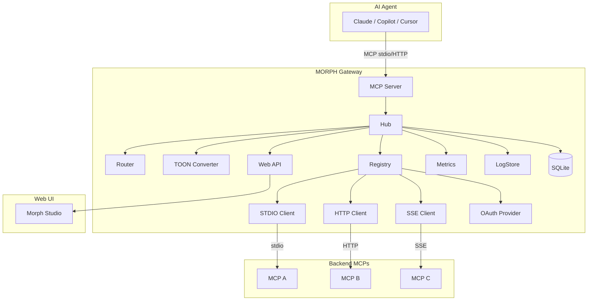
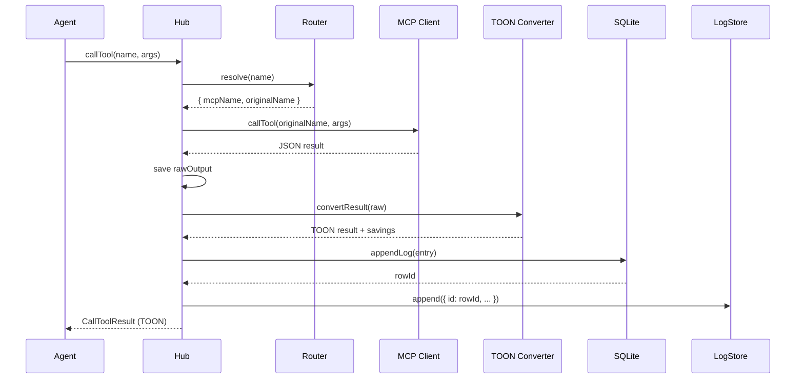
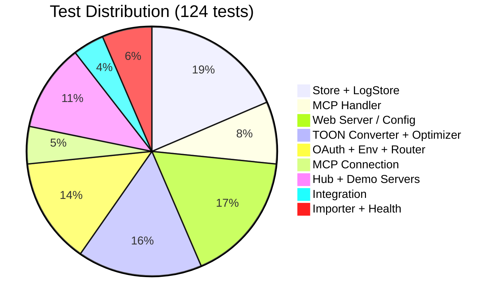
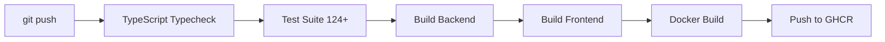
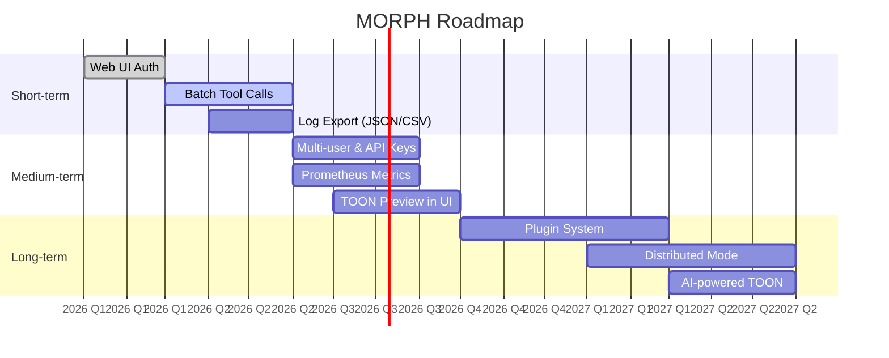

# MORPH — Development Plan & Status

## Current Status (v2.0)

All core features are implemented and tested:

### ✅ Completed

| Area                  | Status | Details                                                      |
| --------------------- | ------ | ------------------------------------------------------------ |
| MCP Client Layer      | ✅     | STDIO, HTTP (Streamable), SSE transports                     |
| OAuth Support         | ✅     | PKCE flow, Dynamic Client Registration, token persistence    |
| Tool Router           | ✅     | Name resolution, conflict auto-prefix, aliases               |
| TOON Converter        | ✅     | JSON→TOON, optimizer (uniform array, depth), savings stats   |
| Config System         | ✅     | Zod schema, `${ENV}` resolution, hot-reload watcher          |
| Web API               | ✅     | Fastify REST + WebSocket, OAuth routes                       |
| SQLite Persistence    | ✅     | Logs, call stats, savings history, totalizers                |
| In-memory Log Store   | ✅     | Circular buffer, ID-synced with SQLite                       |
| Web UI (Morph Studio) | ✅     | Dashboard, MCP CRUD, Logs, Stats, Settings                   |
| Log Detail            | ✅     | JSON vs TOON side-by-side, token savings, split view         |
| MCP Tools Modal       | ✅     | Tool listing with JSON/TOON toggle                           |
| Built-in Tools        | ✅     | `_morph_status`, `_morph_toon_stats`, `_morph_reload_config` |
| Demo MCP Servers      | ✅     | STDIO, HTTP, SSE, HTTP+OAuth, STDIO+params                   |
| Tests                 | ✅     | 124+ tests across 16 files                                   |
| Docker                | ✅     | Multi-stage Dockerfile, dev compose, production compose      |

### Architecture Overview



### Key Design Decisions

1. **Two log stores** — In-memory circular buffer for live streaming (`/api/logs`), SQLite for persistence and detail queries (`/api/logs/:id`). IDs are synchronized by writing to SQLite first and using the returned ID.

2. **OAuth provider race fix** — `MorphOAuthProvider.redirectToAuthorization()` stores the pending URL in a field that `waitForRedirect()` checks before creating a new Promise, preventing the race condition where `redirectToAuthorization` is called before `waitForRedirect`.

3. **Built-in tools bypass router** — Prefixed with `_morph_`, handled directly by Hub. All results pass through the TOON converter for consistent output format.

4. **Demo MCP servers** — Five self-contained servers for testing all transport types and features. The OAuth demo includes full metadata, client registration, authorize/token endpoints, and accepts `demo-token` via `apiKey`.

### Data Flow



### Ports

| Service        | Port | Purpose                                           |
| -------------- | ---- | ------------------------------------------------- |
| Backend API    | 3101 | Fastify REST + WebSocket                          |
| Frontend (dev) | 5173 | Vite dev server (proxies /api and /ws to backend) |
| Demo HTTP MCP  | 3200 | Demo MCP via HTTP                                 |
| Demo SSE MCP   | 3201 | Demo MCP via SSE                                  |
| Demo OAuth MCP | 3202 | Demo MCP via HTTP + OAuth                         |

### Test Coverage



```
16 test files, 124+ tests:

┌─────────────────────────────────────────────────────┐
│ Unit Tests (118)                                     │
│  ├── store.test.ts          18  SQLite + ID sync     │
│  ├── log-store.test.ts       5  ID + field tests     │
│  ├── hub.test.ts             6  Built-in TOON        │
│  ├── demo-servers.test.ts    8  Demo MCP startup     │
│  ├── mcp-connection.test.ts  6  Registry lifecycle   │
│  ├── mcp-handler.test.ts    10  JSON-RPC handler     │
│  ├── web-server.test.ts     14  Schema validation    │
│  ├── toon-converter.test.ts  4  TOON encode/decode   │
│  ├── optimizer.test.ts      16  Uniform array + more │
│  ├── router.test.ts          5  Tool resolution      │
│  ├── oauth-store.test.ts     7  OAuth CRUD           │
│  ├── config-loader.test.ts   7  Config parsing       │
│  ├── env-resolver.test.ts    5  Environment vars     │
│  ├── importer.test.ts        4  Config import        │
│  └── health-checker.test.ts  4  Health checker       │
├── Integration Tests (6)                               │
│  └── tool-routing.test.ts    5  Real MCP round-trip  │
└─────────────────────────────────────────────────────┘
```

### CI/CD Pipeline



## Future Roadmap



### Short-term

- [ ] Web UI Basic Auth configuration page
- [ ] Batch tool call execution
- [ ] Export logs as JSON/CSV

### Medium-term

- [ ] Multi-user support with API keys
- [ ] Prometheus metrics endpoint
- [ ] TOON conversion preview in Web UI

### Long-term

- [ ] Plugin system for custom converters
- [ ] Distributed mode (multiple MORPH instances)
- [ ] AI-powered TOON optimization suggestions
