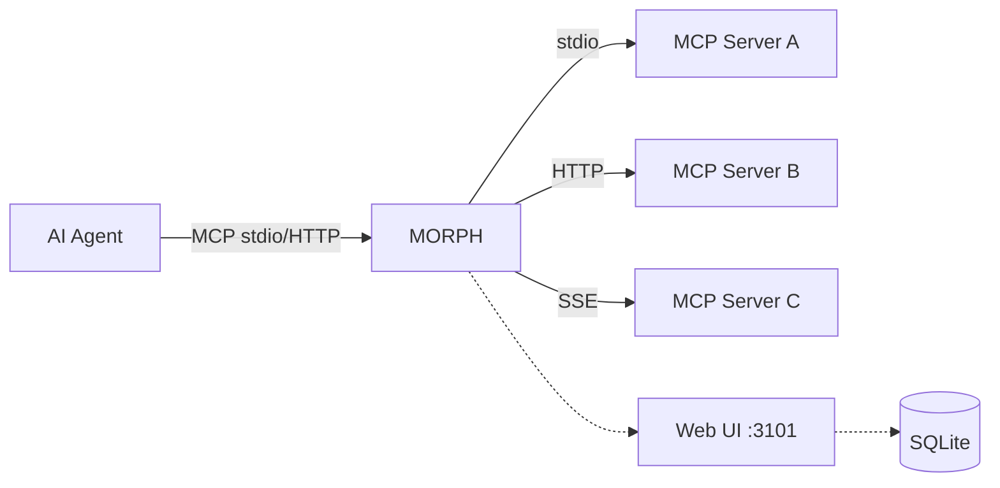
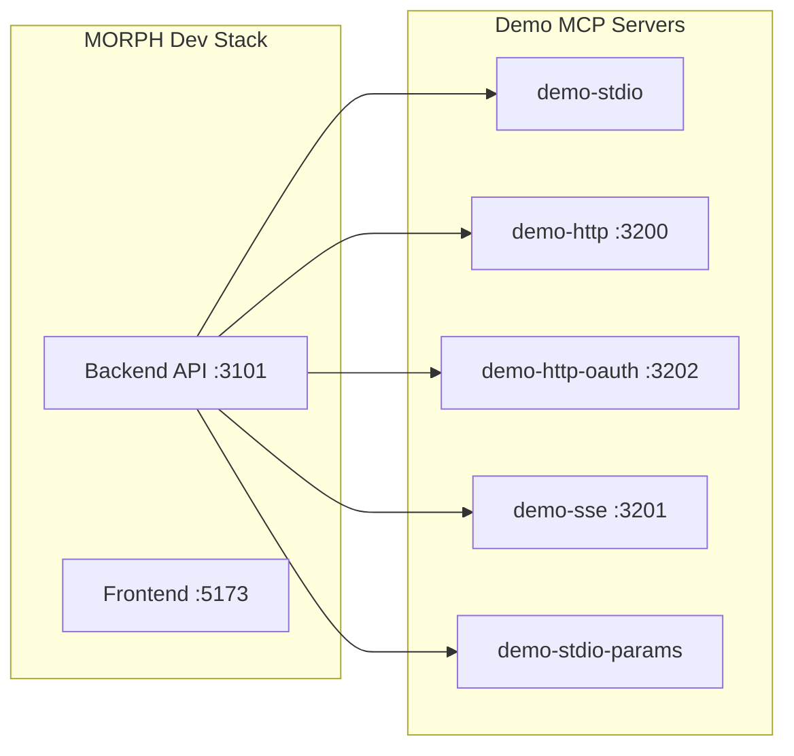
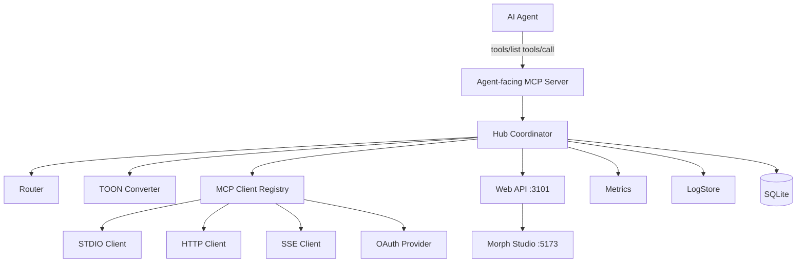

# MORPH

**MCP Optimized Response Protocol Handler** — v2.0

TOON (Token-Oriented Object Notation) is a compact data format that cuts token usage by 30–60% compared to JSON. MORPH is a **gateway proxy** that sits between your AI agents and your MCP servers, automatically converting JSON responses to TOON — no MCP changes required.



## Features

- **Single entry point** — One MCP config for all your servers
- **Automatic TOON conversion** — JSON → TOON on every response, saving 30–60% tokens
- **Multi-transport** — Connect MCPs via stdio, HTTP, or SSE
- **OAuth support** — Built-in OAuth client provider for HTTP MCPs with Dynamic Client Registration
- **Config hot-reload** — Edit `morph.json` or `.mcp.json` without restarting
- **Import existing configs** — Migrate from Claude Desktop or VS Code
- **Web UI (Morph Studio)** — Dashboard, logs, stats, MCP management, TOON savings charts
- **Real-time** — WebSocket for live logs, health, and metrics
- **SQLite persistence** — Call history, token savings, time-series stats
- **Docker-native** — Volume-based config, transport selection via `MORPH_TRANSPORT`
- **124+ tests** — Unit, integration, and connection tests

## Quick Start (Docker)

```bash
# Clone and build
git clone https://github.com/wagner-sousa/morph.git
cd morph

# Start the full dev stack
docker compose -f docker-compose.dev.yml up -d

# Services:
#   Backend (MORPH API)     → http://localhost:3101
#   Frontend (Morph Studio) → http://localhost:5173
#   Demo MCP servers        → ports 3200-3202
```

Open `http://localhost:5173` for the Web UI.

## Demo MCP Servers

MORPH ships with 5 demo MCP servers for testing:



| Name | Transport | Port | Tools |
|------|-----------|------|-------|
| `demo-stdio` | STDIO | — | ping, users, echo |
| `demo-http` | HTTP | 3200 | ping, users, echo |
| `demo-http-oauth` | HTTP + OAuth | 3202 | ping, echo, time, whoami |
| `demo-sse` | SSE | 3201 | ping, users, echo |
| `demo-stdio-params` | STDIO | — | read, write, list, stats |

Start them with:
```bash
docker compose -f docker-compose.dev.yml up -d mcp-test-servers
```

## Configuration

MORPH is configured via two files:

- **`morph.json`** — MORPH settings only (toon / webUi / health / logging):

```json
{
  "morph": { "logLevel": "info" },
  "toon": { "autoConvert": true },
  "webUi": { "enabled": true, "port": 3101 }
}
```

- **`.mcp.json`** — your MCP servers, in the standard Claude/`.mcp.json` keyed
  format. A `.mcp.json` from Claude or VS Code can be dropped in as-is:

```json
{
  "mcpServers": {
    "my-server": {
      "command": "npx",
      "args": ["-y", "@org/mcp-server"],
      "env": { "API_KEY": "${MY_API_KEY}" }
    },
    "my-api": { "type": "http", "url": "https://example.com/mcp" }
  }
}
```

By default `.mcp.json` is looked up next to `morph.json`; override with
`--mcp-config <path>` or `MORPH_MCP_CONFIG`. Optional per-server morph fields
(`enabled`, `description`, `aliases`, `labels`) may be added but are never
required. Import from another tool with `morph import --from <file>` (Claude and
VS Code formats).

See [Configuration](https://wagner-sousa.github.io/morph/02-usage/010_configuration/) for the complete reference.

## Agent Setup

Add MORPH as the **only** MCP server in your agent config:

```json
{
  "mcpServers": {
    "morph": {
      "command": "docker",
      "args": [
        "run", "-i", "--rm",
        "-v", "/path/to/config:/config:ro",
        "-e", "MORPH_CONFIG=/config/morph.json",
        "-e", "MORPH_MCP_CONFIG=/config/.mcp.json",
        "-e", "MORPH_TRANSPORT=stdio",
        "morph:latest"
      ]
    }
  }
}
```

## Web UI (Morph Studio)

| Route | Page |
|-------|------|
| `/` | Dashboard — status, calls/min, TOON savings, totalizers |
| `/mcps` | MCP CRUD — add, edit, remove, toggle servers (inline modal) |
| `/logs` | Call history with search and level filter |
| `/logs/:id` | Log detail — JSON original vs TOON, token savings |
| `/stats` | TOON savings charts (bar, pie) |
| `/settings` | Global config, import |

Real-time updates via WebSocket at `ws://<host>/ws`.

## Architecture



See [Architecture](https://wagner-sousa.github.io/morph/01-about/030_architecture/) for details.

## Development

```bash
# Dev stack (hot-reload)
docker compose -f docker-compose.dev.yml up -d

# Run tests
docker run --rm -v "$PWD":/app -w /app node:22 sh -c "npm install && npm test"

# Build
docker run --rm -v "$PWD":/app -w /app node:22 sh -c "npm install && npm run build"
```

See [Development Guide](https://wagner-sousa.github.io/morph/03-development/000_development/).

## Documentation

- [Architecture](https://wagner-sousa.github.io/morph/01-about/030_architecture/) — components, layers, data flow
- [Configuration](https://wagner-sousa.github.io/morph/02-usage/010_configuration/) — every `morph.json` field with examples
- [Development Guide](https://wagner-sousa.github.io/morph/03-development/000_development/) — SDD workflow, layout, testing

## License

MIT
