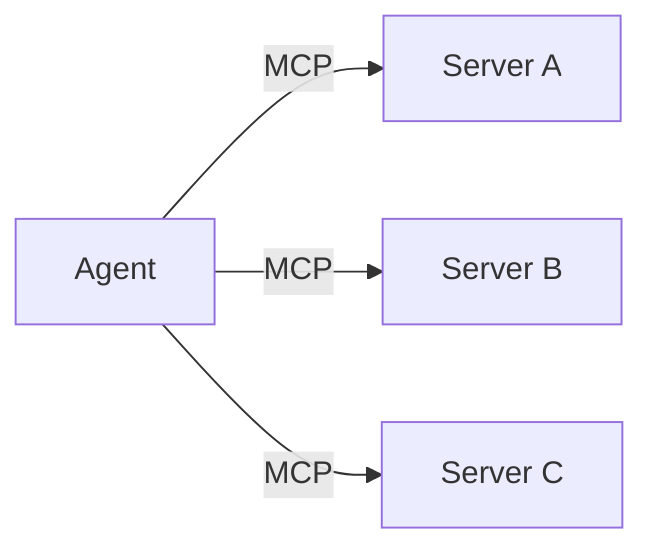
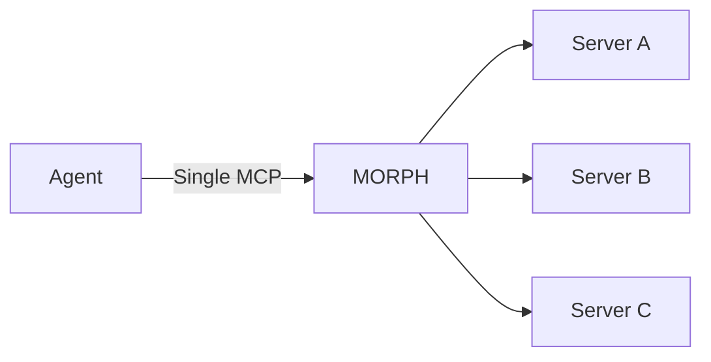

# About MORPH

MORPH is a **gateway proxy** that unifies multiple MCP servers behind a single endpoint. It converts JSON responses to TOON automatically, saving 30–60% on token usage.

## Why MORPH?

Without MORPH, your AI agent needs a separate MCP connection for every backend server:

With MORPH:

## Key Benefits

| Benefit                    | Description                                   |
| -------------------------- | --------------------------------------------- |
| **Token savings**          | TOON conversion cuts 30–60% of tokens vs JSON |
| **Single endpoint**        | No per-server MCP configuration needed        |
| **Centralized monitoring** | Dashboard, logs, stats in one place           |
| **Transport agnostic**     | Mix stdio, HTTP, SSE servers freely           |
| **Live config updates**    | Edit morph.json without restarting            |
