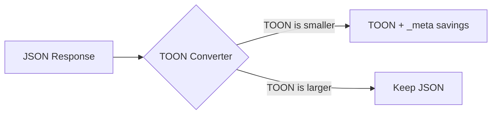
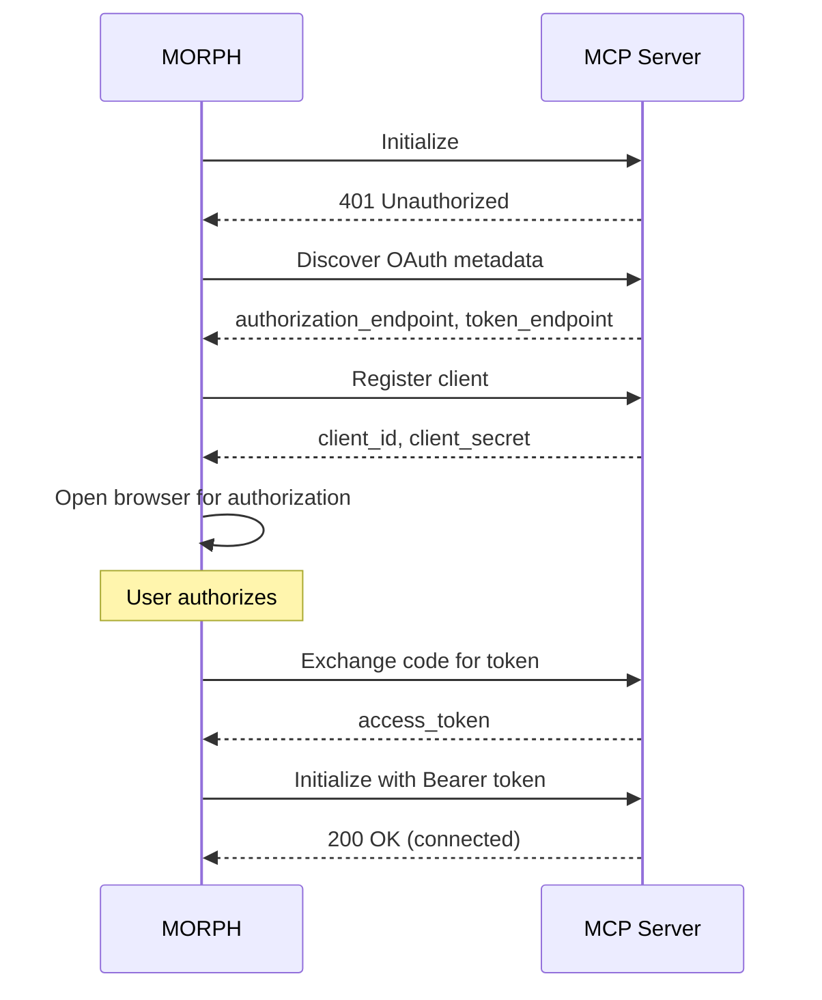

# Features

## TOON Conversion

TOON (Token-Oriented Object Notation) is a compact data format that reduces token usage by 30–60% compared to JSON.



## Multi-Transport Support

Connect MCP servers via any supported transport:

| Transport | Description                    | Use Case                 |
| --------- | ------------------------------ | ------------------------ |
| **STDIO** | Child process via stdin/stdout | Local servers, CLIs      |
| **HTTP**  | Streamable HTTP transport      | Remote servers, OAuth    |
| **SSE**   | Server-Sent Events             | Legacy streaming servers |

## OAuth Support

MORPH implements the full OAuth 2.0 Authorization Code flow with PKCE for HTTP MCPs:



## Real-Time WebSocket

Live updates on three channels:

| Channel  | Data                  | Frequency             |
| -------- | --------------------- | --------------------- |
| `logs`   | New log entries       | On each tool call     |
| `stats`  | Aggregated metrics    | On savings update     |
| `health` | MCP connection events | On connect/disconnect |

## SQLite Persistence

All call history, token savings, and time-series stats are persisted to SQLite:

```mermaid
flowchart LR
    A[Tool Call] --> B[In-Memory LogStore]
    A --> C[(SQLite)]
    B --> D[/api/logs]
    C --> E[/api/logs/:id]
    C --> F[/api/stats]
    C --> G[/api/calls/totalizers]
```

## Config Hot-Reload

The `ConfigWatcher` (chokidar, 300ms debounce) watches `morph.json` for changes. Only valid configs are applied — invalid ones log an error without crashing the server.
