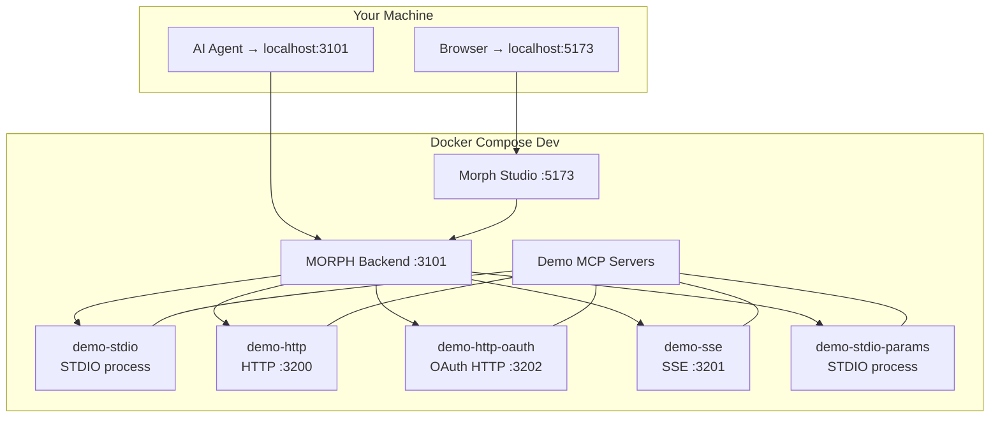

# Demo MCP Servers

MORPH ships with **5 demo MCP servers** covering every supported transport. They are self-contained (no external dependencies) and ideal for experimenting with the platform.

## Server Overview

| Server | Transport | Port | Config Name | Description |
|--------|-----------|------|-------------|-------------|
| `demo-stdio` | STDIO | — | `demo-stdio` | Basic tools via child process stdin/stdout |
| `demo-http` | HTTP (Streamable) | `3200` | `demo-http` | Same tools over HTTP, no auth |
| `demo-http-oauth` | HTTP with OAuth | `3202` | `demo-http-oauth` | HTTP with OAuth 2.0 / PKCE challenge |
| `demo-sse` | SSE | `3201` | `demo-sse` | Legacy Server-Sent Events transport |
| `demo-stdio-params` | STDIO | — | `demo-stdio-params` | Parameterized file-system tools with env config |

## Starting the Servers

All demo servers are defined in `docker-compose.dev.yml` under the `mcp-test-servers` service:

```bash
# Start all dev services (MORPH + Studio + demo MCPs)
docker compose -f docker-compose.dev.yml up -d

# Start only the demo MCP servers
docker compose -f docker-compose.dev.yml up -d mcp-test-servers

# View their logs
docker compose -f docker-compose.dev.yml logs -f mcp-test-servers

# Restart them
docker compose -f docker-compose.dev.yml restart mcp-test-servers
```

The servers are pre-configured in `morph.json` so they connect automatically when MORPH starts.

## Tools by Server

### `demo-stdio` / `demo-http` / `demo-sse`

These three servers expose the same basic tools:

| Tool | Description | Input |
|------|-------------|-------|
| `ping` | Health check — returns `"pong"` | None |
| `users` | Returns a uniform array of user objects (ideal TOON candidate) | `count` (number, default 25, max 500) |
| `echo` | Echoes back the provided arguments | Any JSON |

### `demo-http-oauth`

Same as above plus two extra tools:

| Tool | Description | Input |
|------|-------------|-------|
| `ping` | Health check — returns `"pong"` | None |
| `echo` | Echoes back provided arguments | Any JSON |
| `time` | Returns the current server time as ISO string | None |
| `whoami` | Returns authenticated client information | None |

### `demo-stdio-params`

Parameterized file-system tools operating on `/tmp/demo`:

| Tool | Description | Input Parameters |
|------|-------------|------------------|
| `read` | Read file contents | `path` (required), `encoding`, `maxSize` |
| `write` | Write content to a file | `path` (required), `content` (required), `append` |
| `list` | List directory contents | `dir` (required), `pattern`, `recursive` |
| `stats` | Get file or directory metadata | `path` (required) |

## Dev Stack Architecture



## Configuration Reference

Each server is defined in `morph.json` under `mcpServers[]`. Here is the complete configuration block for all five:

```json
{
  "mcpServers": [
    {
      "name": "demo-stdio",
      "enabled": true,
      "description": "Demo MCP via STDIO with basic tools (ping, users, echo)",
      "transport": {
        "type": "stdio",
        "command": "node",
        "args": ["dist/examples/demo-mcp-server.js"]
      }
    },
    {
      "name": "demo-http",
      "enabled": true,
      "description": "Demo MCP via HTTP without authentication",
      "transport": {
        "type": "http",
        "url": "http://mcp-test-servers:3200/mcp"
      }
    },
    {
      "name": "demo-http-oauth",
      "enabled": true,
      "description": "Demo MCP via HTTP with OAuth authentication mock",
      "transport": {
        "type": "http",
        "url": "http://mcp-test-servers:3202/mcp",
        "apiKey": "demo-token"
      }
    },
    {
      "name": "demo-sse",
      "enabled": true,
      "description": "Demo MCP via SSE streaming transport",
      "transport": {
        "type": "sse",
        "url": "http://mcp-test-servers:3201/sse"
      }
    },
    {
      "name": "demo-stdio-params",
      "enabled": true,
      "description": "Demo MCP with parameterized tools (read/write/list/stats) and env DEMO_MODE",
      "transport": {
        "type": "stdio",
        "command": "node",
        "args": ["dist/examples/param-mcp-server.js", "--base-path", "/tmp/demo"],
        "env": { "DEMO_MODE": "true" }
      }
    }
  ]
}
```
