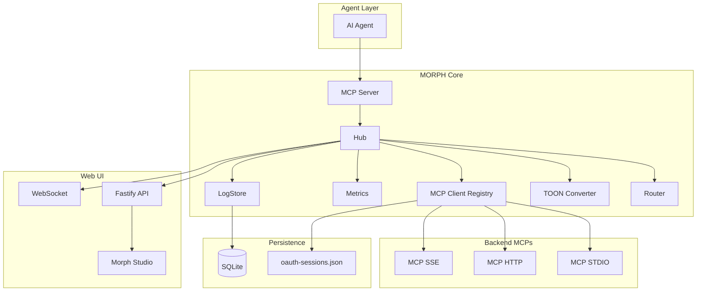
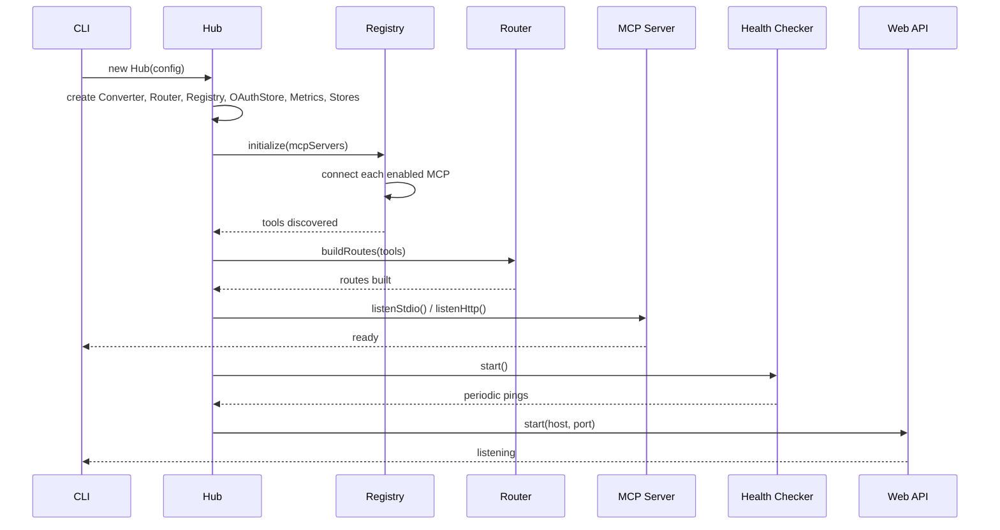
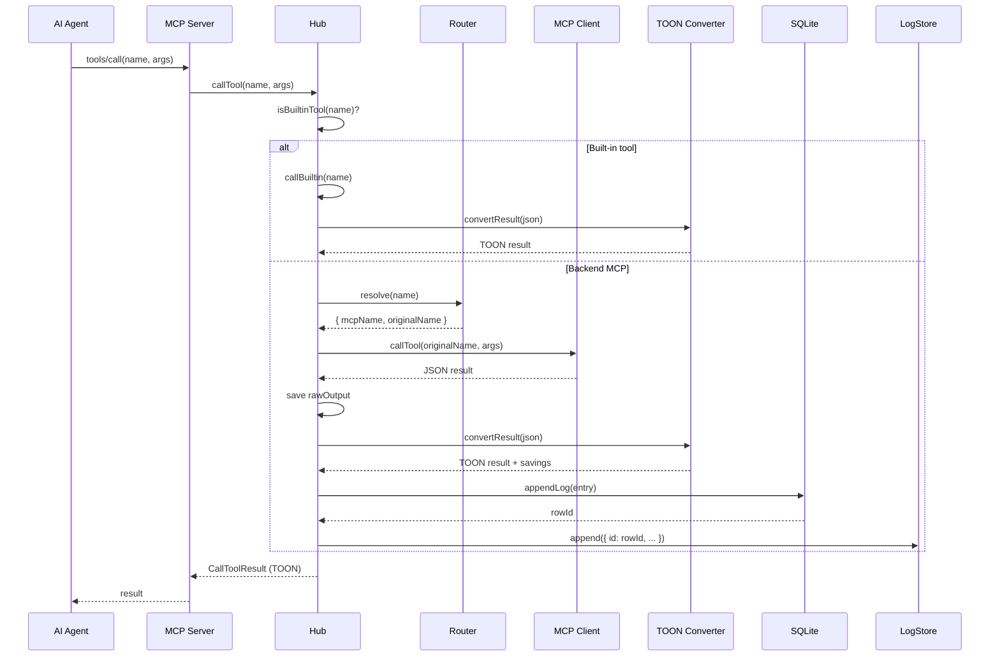
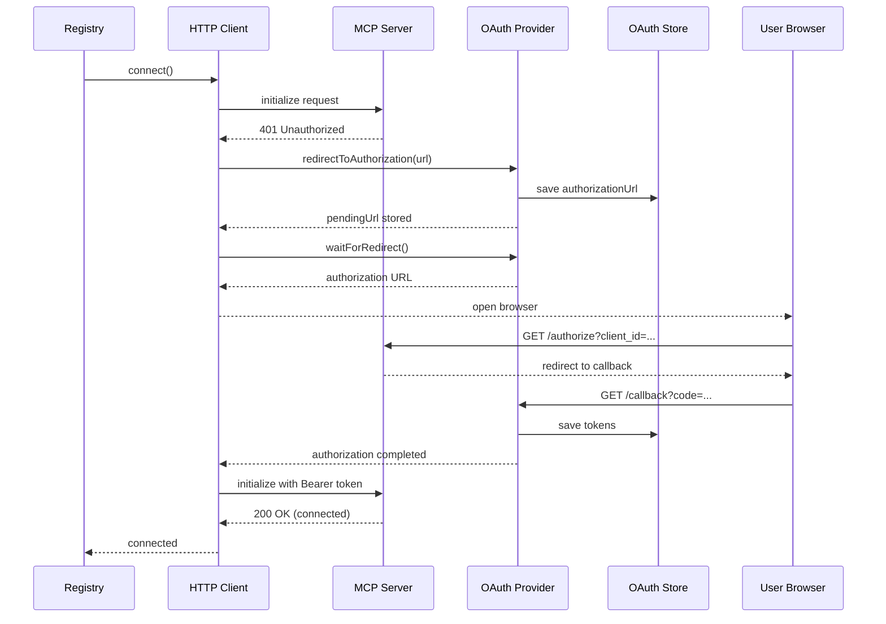
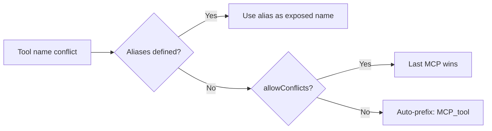

# Architecture

MORPH is an MCP server that proxies to other MCP servers. The AI agent connects to MORPH over stdio or HTTP; MORPH fans out to backend MCPs over stdio/HTTP/SSE, converts JSON results to TOON, and returns them.

## Layers



| Layer                   | Code                                        | Responsibility                                                                        |
| ----------------------- | ------------------------------------------- | ------------------------------------------------------------------------------------- |
| Agent-facing MCP server | `src/mcp-server/server.ts`                  | Exposes `tools/list` + `tools/call` to the agent                                      |
| Hub                     | `src/hub.ts`                                | Coordinates everything; routes calls, converts, records metrics, persists logs        |
| Router                  | `src/router/`                               | Maps exposed tool name → backend MCP (+ conflict resolution)                          |
| MCP client factory      | `src/mcp-client/factory.ts`                 | Builds a client per transport type                                                    |
| MCP clients             | `src/mcp-client/{stdio,http,sse}-client.ts` | Talk to one backend each (extend `BaseMCPClient`)                                     |
| Registry                | `src/mcp-client/registry.ts`                | Lifecycle: connect/disconnect/hot add/remove, tool cache, OAuth provider creation     |
| OAuth provider          | `src/mcp-client/oauth-provider.ts`          | MCP SDK OAuthClientProvider — PKCE, redirect, token storage                           |
| OAuth store             | `src/mcp-client/oauth-store.ts`             | Persists OAuth sessions (tokens, PKCE verifier, client info) to `oauth-sessions.json` |
| TOON converter          | `src/toon/`                                 | JSON→TOON conversion + optimizer + savings stats                                      |
| Health checker          | `src/health/checker.ts`                     | Periodic ping of backends                                                             |
| Config                  | `src/config/`                               | Load, validate (zod), `${ENV}` resolution, file watch                                 |
| Web API                 | `src/web/server.ts`                         | Fastify REST + WebSocket + static Studio                                              |
| SQLite persistence      | `src/persistence/store.ts`                  | Logs, call stats, token savings, totalizers                                           |
| In-memory log store     | `src/logging/store.ts`                      | Circular buffer for live log stream (IDs synced with SQLite)                          |
| Metrics                 | `src/metrics.ts`                            | Live aggregate stats (calls, tokens, savings by MCP)                                  |

## Startup Flow



1. Load & validate `morph.json`, resolve `${ENV_VAR}`.
2. `Hub` constructor: create converter, router, registry, OAuth store, metrics, stores.
3. `Registry.initialize()` — connect every enabled MCP, discover tools.
   - HTTP MCPs with OAuth: registry creates a `MorphOAuthProvider` per MCP.
   - If the server returns 401, the SDK transport initiates the OAuth flow.
4. `Router.buildRoutes()` — aggregate tools, resolve name conflicts (auto-prefix or aliases).
5. `MorphMCPServer` connects over stdio (agent transport).
6. Health checker starts; config watcher arms hot-reload.
7. Web API (Fastify) listens on the configured port.

## Tool-Call Flow



## OAuth Flow

When an HTTP MCP returns a 401 challenge, MORPH automatically initiates the OAuth 2.0 Authorization Code flow with PKCE:



## Log ID Synchronization

The system uses **two stores** — an in-memory circular buffer (`LogStore` for the live `/api/logs` stream) and SQLite (`Store` for persistence and `/api/logs/:id` detail queries). Their IDs are synchronized by always writing to SQLite first and using the returned `lastInsertRowid` for the LogStore entry. This ensures clicking a log in the list always shows the correct detail.

```mermaid
flowchart LR
    A[Tool call] --> B[Store.appendLog]
    B --> C[(SQLite)]
    C -->|returns rowId| D[LogStore.append]
    D --> E[In-memory buffer]
    E --> F[/api/logs]
    C --> G[/api/logs/:id]
    F & G --> H[Same ID always]
```

## Built-in Tools

Tools prefixed with `_morph_` are handled directly by the Hub (never routed):

| Tool                   | Description                                                |
| ---------------------- | ---------------------------------------------------------- |
| `_morph_status`        | MORPH status: connected MCPs, tools count, uptime, version |
| `_morph_toon_stats`    | Aggregate TOON token-savings statistics                    |
| `_morph_reload_config` | Force reload of `morph.json` from disk                     |

All built-in results pass through the TOON converter for consistent output format.

## Conflict Resolution

When two MCPs expose the same tool name, the Router:



1. Honors an explicit `aliases` entry from config.
2. Otherwise auto-prefixes both as `${mcp}_${tool}`.
3. If `morph.allowConflicts` is set, the last MCP wins (logged warning).

## Hot-Reload

`ConfigWatcher` (chokidar, 300 ms debounce) emits only _valid_ configs. The Hub diffs old vs new and applies adds/removes/updates to the registry without a full restart, then rebuilds the router and notifies the agent via `notifications/tools/list_changed`.

## Graceful Shutdown

On `SIGTERM`/`SIGINT`: close the agent transport → drain in-flight calls (with `MORPH_SHUTDOWN_TIMEOUT`) → stop health checker & watcher → disconnect backends → close web server & SQLite → exit.
