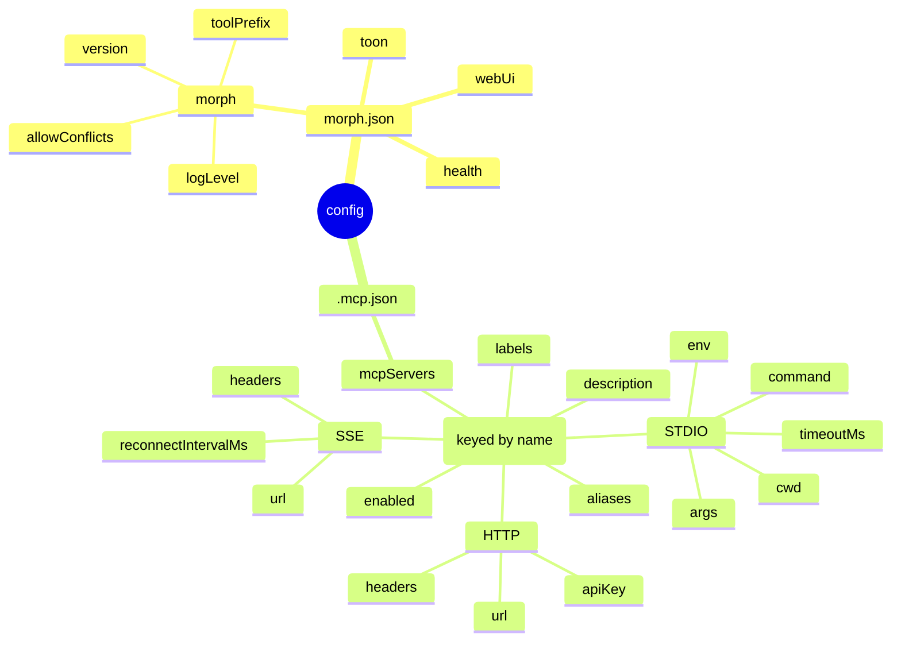
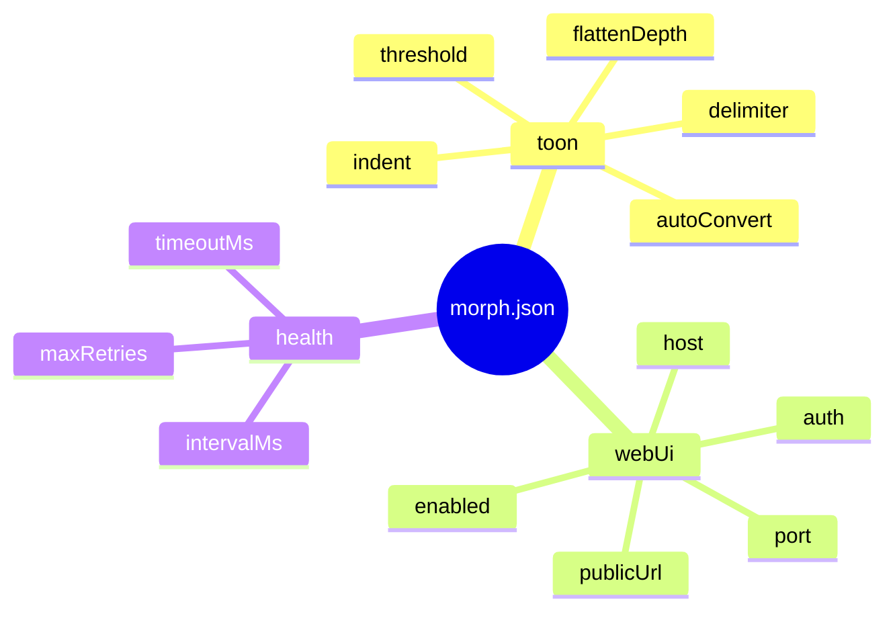
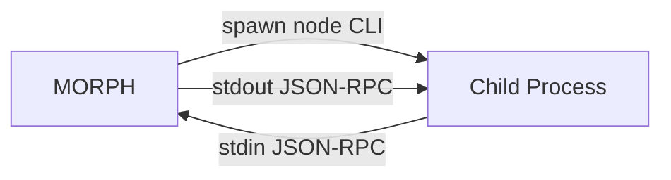
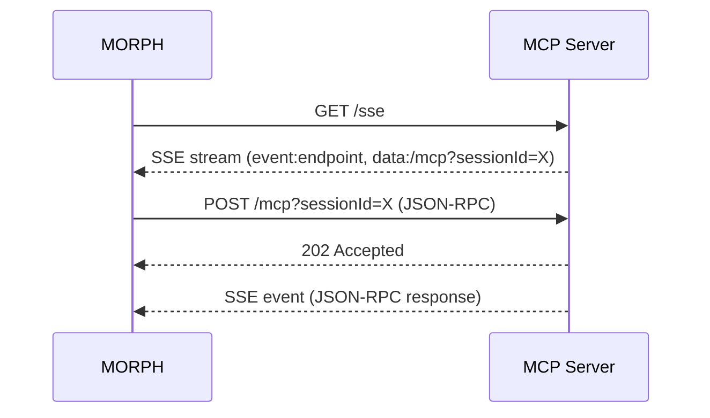

# Configuration

Configuration lives in **two files**:

- **`morph.json`** — MORPH settings (`morph`, `toon`, `webUi`, `health`), validated against `schema.json`.
- **`.mcp.json`** — the MCP servers, in the standard Claude/`.mcp.json` keyed-object format, validated against `mcp.schema.json`.

Both schemas are generated from the zod schema via `npm run gen:schema`. By default `.mcp.json` is looked up next to `morph.json` (override with `--mcp-config` / `MORPH_MCP_CONFIG`). All string values support `${ENV_VAR}` interpolation, resolved from the environment / `.env`. A standard `.mcp.json` exported from Claude or VS Code can be used directly — none of the morph-specific fields are required.

Both files are **local instance config** and git-ignored (like `.env`). Copy the committed templates to get started:

```bash
cp morph.example.json morph.json
cp .mcp.example.json .mcp.json
```

The committed `morph.demo.json` / `.mcp.demo.json` power the `docker-compose.dev.yml` demo stack and require no copying.

## Schema Overview



The `morph.json` settings are detailed below; `.mcp.json` is detailed in the `mcpServers` section.



## Top-Level

| Field                  | Type                       | Default   | Notes                                                             |
| ---------------------- | -------------------------- | --------- | ----------------------------------------------------------------- |
| `morph.version`        | string                     | `"1.0"`   | Schema version                                                    |
| `morph.logLevel`       | `debug\|info\|warn\|error` | `info`    |                                                                   |
| `morph.allowConflicts` | boolean                    | `false`   | Last MCP wins on tool-name conflict                               |
| `morph.toolPrefix`     | string                     | —         | Prefix pattern for all exposed tools, e.g. `{name}_` or `{name}:` |
| `toon`                 | object                     | see below | TOON conversion options                                           |
| `webUi`                | object                     | see below | Web UI / API                                                      |
| `health`               | object                     | see below | Health-check cadence                                              |

> MCP servers no longer live in `morph.json` — they are defined in `.mcp.json` (see below).

## `mcpServers` (`.mcp.json`)

`.mcp.json` uses the standard Claude keyed-object format: each server is an entry
under `mcpServers`, **keyed by its name**. The transport is inferred from the
fields — an entry with `type: "http"|"sse"` + `url` is that transport, anything
else is `stdio` (so a Claude stdio entry with just `command` works as-is).

```json
{
  "$schema": "./mcp.schema.json",
  "mcpServers": {
    "filesystem": { "command": "npx", "args": ["-y", "@org/server"] },
    "my-api": { "type": "http", "url": "https://example.com/mcp" }
  }
}
```

Per-server fields (all optional except the transport fields):

| Field            | Type                    | Required | Notes                                                         |
| ---------------- | ----------------------- | -------- | ------------------------------------------------------------- |
| _(key)_          | string                  | ✅       | The object key is the server name; `[A-Za-z0-9_.-]`           |
| `enabled`        | boolean                 | —        | Toggle without removing (default `true`)                      |
| `description`    | string                  | —        | Human-readable label                                          |
| `labels`         | `Record<string,string>` | —        | Metadata tags (team, type, env)                               |
| `aliases`        | `Record<string,string>` | —        | `originalName → exposedName` overrides                        |
| transport fields | —                       | ✅       | `command`/`args`/… (stdio) or `type`+`url`/… (http/sse) below |

### Transport: STDIO (local process)



```json
{
  "name": "filesystem",
  "enabled": true,
  "description": "Local file system access",
  "labels": { "team": "engineering", "type": "utility" },
  "aliases": { "read_file": "fs_read" },
  "transport": {
    "type": "stdio",
    "command": "npx",
    "args": ["-y", "@modelcontextprotocol/server-filesystem", "/data"],
    "env": { "NODE_OPTIONS": "--max-old-space-size=512" },
    "cwd": "/opt/mcp",
    "timeoutMs": 30000
  }
}
```

| Field       | Type                    | Required | Notes                                        |
| ----------- | ----------------------- | -------- | -------------------------------------------- |
| `type`      | `"stdio"`               | ✅       |                                              |
| `command`   | string                  | ✅       | Executable path or name                      |
| `args`      | string[]                | —        | Command arguments (default `[]`)             |
| `env`       | `Record<string,string>` | —        | Environment variables, supports `${ENV_VAR}` |
| `cwd`       | string                  | —        | Working directory                            |
| `timeoutMs` | number                  | —        | Process timeout in milliseconds              |

### Transport: HTTP (Streamable HTTP)

```mermaid
flowchart LR
    M[MORPH] -->|POST JSON-RPC| S[MCP Server]
    S -->|JSON-RPC response| M
    alt OAuth
        S -->|401 challenge| M
        M -->|OAuth flow| S
    end
```

```json
{
  "name": "stripe",
  "enabled": true,
  "description": "Stripe API via MCP",
  "labels": { "team": "payments", "env": "production" },
  "transport": {
    "type": "http",
    "url": "https://mcp.stripe.com",
    "headers": {
      "Authorization": "Bearer ${STRIPE_API_KEY}",
      "X-Custom": "value"
    },
    "apiKey": "${STRIPE_API_KEY}"
  }
}
```

| Field     | Type                    | Required | Notes                                                                     |
| --------- | ----------------------- | -------- | ------------------------------------------------------------------------- |
| `type`    | `"http"`                | ✅       |                                                                           |
| `url`     | string                  | ✅       | Server endpoint (must point to the MCP endpoint)                          |
| `headers` | `Record<string,string>` | —        | HTTP headers sent with every request                                      |
| `apiKey`  | string                  | —        | Shorthand for `Authorization: Bearer <key>`. Bypasses OAuth flow when set |

> **OAuth:** When `apiKey` is not set and the server returns 401, MORPH automatically initiates the OAuth 2.0 Authorization Code flow with PKCE. The server must expose a valid `/.well-known/oauth-authorization-server` endpoint and support Dynamic Client Registration.

### Transport: SSE (Server-Sent Events)



```json
{
  "name": "stream-server",
  "enabled": true,
  "description": "Legacy SSE-based MCP server",
  "transport": {
    "type": "sse",
    "url": "https://example.com/sse",
    "headers": {
      "Authorization": "Bearer ${API_KEY}"
    },
    "reconnectIntervalMs": 5000
  }
}
```

| Field                 | Type                    | Required | Notes                                                    |
| --------------------- | ----------------------- | -------- | -------------------------------------------------------- |
| `type`                | `"sse"`                 | ✅       |                                                          |
| `url`                 | string                  | ✅       | SSE endpoint URL                                         |
| `headers`             | `Record<string,string>` | —        | HTTP headers for both SSE and POST requests              |
| `reconnectIntervalMs` | number                  | —        | Reconnection delay on disconnect (default SDK behaviour) |

## `toon`

| Field          | Type               | Default | Notes                        |
| -------------- | ------------------ | ------- | ---------------------------- |
| `autoConvert`  | boolean            | `true`  | Convert JSON results to TOON |
| `delimiter`    | `comma\|tab\|pipe` | `comma` | Tabular delimiter            |
| `indent`       | int 0–8            | `2`     | Spaces per level             |
| `flattenDepth` | int ≥0             | `4`     | >0 enables safe key-folding  |
| `threshold`    | int ≥0             | `100`   | Min chars before converting  |

```json
{
  "toon": {
    "autoConvert": true,
    "delimiter": "comma",
    "indent": 2,
    "flattenDepth": 4,
    "threshold": 100
  }
}
```

## `webUi`

| Field                                 | Type    | Default   | Notes                                 |
| ------------------------------------- | ------- | --------- | ------------------------------------- |
| `enabled`                             | boolean | `true`    |                                       |
| `host`                                | string  | `0.0.0.0` |                                       |
| `port`                                | int     | `3100`    |                                       |
| `publicUrl`                           | string  | —         | Public-facing URL for OAuth redirects |
| `auth.username` / `auth.passwordHash` | string  | —         | Basic Auth credentials                |

Basic Auth is enabled when `MORPH_WEB_USERNAME` (env) is set; requests to `/api/*` and `/ws` are then challenged.

```json
{
  "webUi": {
    "enabled": true,
    "host": "0.0.0.0",
    "port": 3101,
    "publicUrl": "https://morph.example.com"
  }
}
```

## `health`

| Field        | Type | Default | Notes |
| ------------ | ---- | ------- | ----- |
| `intervalMs` | int  | `30000` |       |
| `timeoutMs`  | int  | `5000`  |       |
| `maxRetries` | int  | `3`     |       |

```json
{
  "health": {
    "intervalMs": 30000,
    "timeoutMs": 5000,
    "maxRetries": 3
  }
}
```

## Complete Multi-Server Example (`.mcp.json`)

```json
{
  "$schema": "./mcp.schema.json",
  "mcpServers": {
    "demo-stdio": {
      "description": "Demo MCP via STDIO",
      "command": "node",
      "args": ["dist/examples/demo-mcp-server.js"]
    },
    "demo-http": {
      "description": "Demo MCP via HTTP",
      "type": "http",
      "url": "http://localhost:3200/mcp"
    },
    "demo-http-oauth": {
      "description": "Demo MCP via HTTP with OAuth",
      "type": "http",
      "url": "http://localhost:3202/mcp",
      "apiKey": "demo-token"
    },
    "demo-sse": {
      "description": "Demo MCP via SSE",
      "type": "sse",
      "url": "http://localhost:3201/sse"
    },
    "demo-stdio-params": {
      "description": "Demo MCP with parameterized tools",
      "command": "node",
      "args": ["dist/examples/param-mcp-server.js", "--base-path", "/tmp/demo"],
      "env": { "DEMO_MODE": "true" }
    }
  }
}
```

## Full Reference

`morph.json` (settings):

```json
{
  "$schema": "./schema.json",
  "morph": {
    "version": "1.0",
    "logLevel": "info",
    "allowConflicts": false
  },
  "toon": {
    "autoConvert": true,
    "delimiter": "comma",
    "indent": 2,
    "flattenDepth": 4,
    "threshold": 100
  },
  "webUi": {
    "enabled": true,
    "host": "0.0.0.0",
    "port": 3101
  },
  "health": {
    "intervalMs": 30000,
    "timeoutMs": 5000,
    "maxRetries": 3
  }
}
```

`.mcp.json` (servers, all optional fields shown on one entry):

```json
{
  "$schema": "./mcp.schema.json",
  "mcpServers": {
    "example": {
      "enabled": true,
      "description": "Example server",
      "labels": { "env": "dev" },
      "aliases": { "read_file": "fs_read" },
      "command": "npx",
      "args": ["-y", "@org/server"],
      "env": { "TOKEN": "${TOKEN}" },
      "cwd": "/opt/server",
      "timeoutMs": 30000
    }
  }
}
```

## Environment Variables

| Var                                         | Purpose                                                         |
| ------------------------------------------- | --------------------------------------------------------------- |
| `MORPH_CONFIG`                              | Path to `morph.json` (settings)                                 |
| `MORPH_MCP_CONFIG`                          | Path to `.mcp.json` (servers); default: sibling of `morph.json` |
| `MORPH_DATA_DIR`                            | SQLite directory (default `./data`)                             |
| `MORPH_TRANSPORT`                           | `stdio` (default) or `http`                                     |
| `MORPH_SHUTDOWN_TIMEOUT`                    | Drain timeout ms (default `10000`)                              |
| `MORPH_WEB_USERNAME` / `MORPH_WEB_PASSWORD` | Web Basic Auth                                                  |
| `CORS_ORIGIN`                               | Allowed origin in production                                    |

## Importing Existing Configs

Import writes into `.mcp.json` (Claude and VS Code formats are supported):

```bash
# Claude Desktop
morph import --from ~/.config/Claude/claude_desktop_config.json

# VS Code workspace, into a specific .mcp.json
morph import --from .vscode/mcp.json --merge ./.mcp.json

# Preview without writing
morph import --from other/.mcp.json --dry-run
```

`${input:*}` (VS Code) references are surfaced as warnings to map manually — literal secrets are never copied. Since `.mcp.json` uses the same format as Claude, importing a Claude config is essentially a copy.
