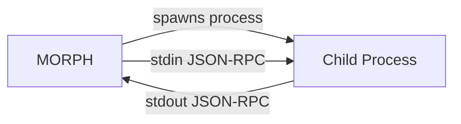
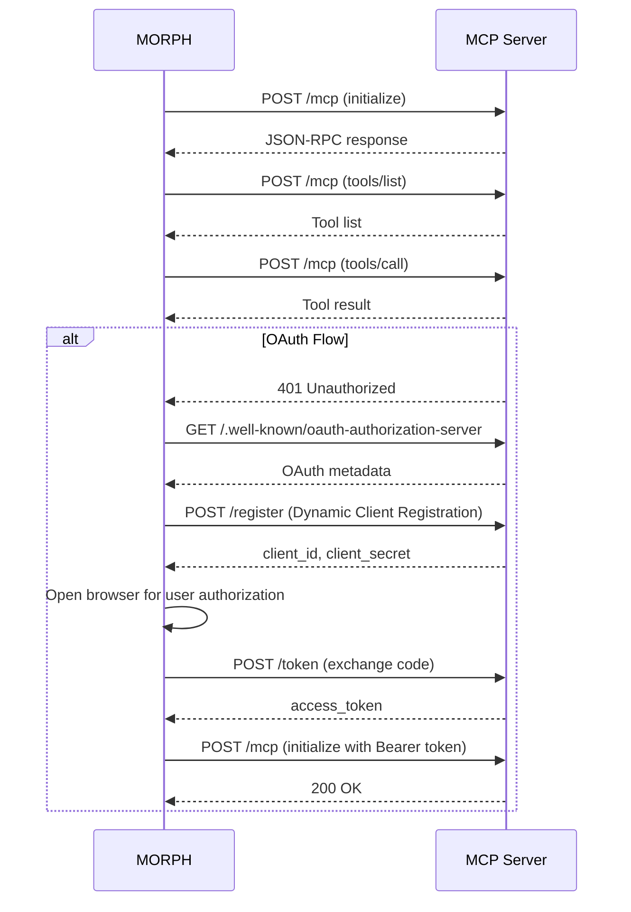
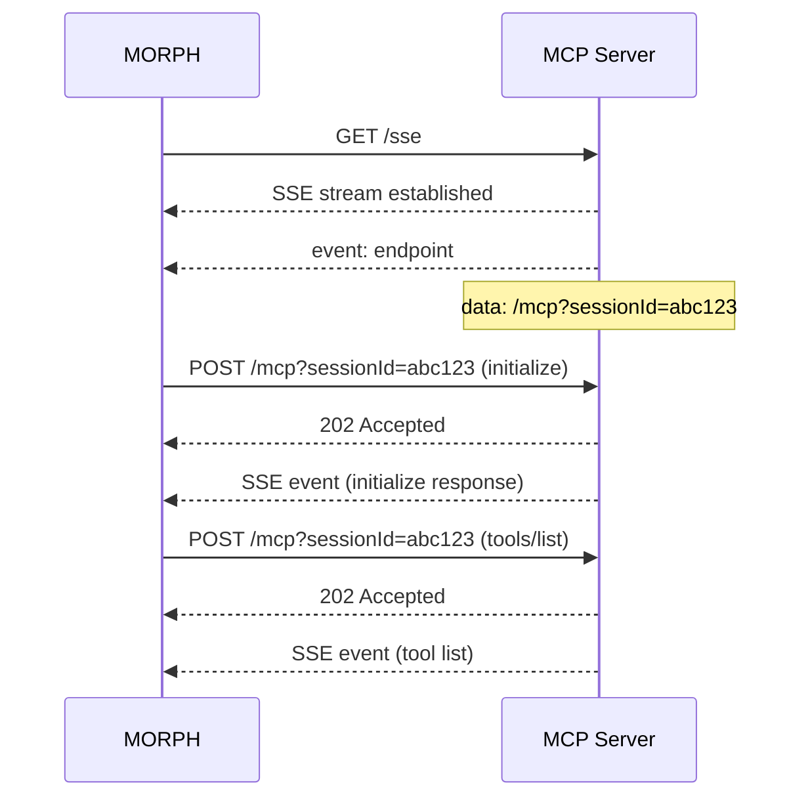

# Transports

MORPH supports three MCP transport types for connecting to backend servers: **STDIO**, **HTTP**, and **SSE**. Each can be used simultaneously — a single MORPH instance can manage servers on different transports.

## STDIO Transport

Spawns a child process and communicates over stdin/stdout using JSON-RPC.



### Config Fields

| Field | Type | Required | Notes |
|-------|------|----------|-------|
| `type` | `"stdio"` | ✅ | |
| `command` | string | ✅ | Executable path or name |
| `args` | string[] | — | Command arguments (default `[]`) |
| `env` | `Record<string,string>` | — | Environment variables, supports `${ENV_VAR}` |
| `cwd` | string | — | Working directory |
| `timeoutMs` | number | — | Process timeout in milliseconds |

### Example

```json
{
  "name": "filesystem",
  "transport": {
    "type": "stdio",
    "command": "npx",
    "args": ["-y", "@modelcontextprotocol/server-filesystem", "/data"],
    "env": { "NODE_OPTIONS": "--max-old-space-size=512" },
    "cwd": "/opt/mcp",
    "timeoutMs": 30000
  }
}
```

### When to use

- Local processes on the same machine as MORPH
- Servers that need access to local filesystem or hardware
- Development and testing

---

## HTTP Transport (Streamable HTTP)

Communicates with a remote MCP server over HTTP using JSON-RPC request/response.



### Config Fields

| Field | Type | Required | Notes |
|-------|------|----------|-------|
| `type` | `"http"` | ✅ | |
| `url` | string | ✅ | Server endpoint (must point to the MCP endpoint) |
| `headers` | `Record<string,string>` | — | HTTP headers sent with every request |
| `apiKey` | string | — | Shorthand for `Authorization: Bearer <key>` |

### Example (with API key)

```json
{
  "name": "stripe",
  "transport": {
    "type": "http",
    "url": "https://mcp.stripe.com",
    "headers": {
      "X-Custom": "value"
    },
    "apiKey": "${STRIPE_API_KEY}"
  }
}
```

### OAuth

When `apiKey` is **not** set and the server returns `401 Unauthorized`, MORPH automatically:

1. Discovers OAuth metadata from `/.well-known/oauth-authorization-server`
2. Registers a client via Dynamic Client Registration (`POST /register`)
3. Opens the authorization URL in a browser for the user to approve
4. Exchanges the authorization code for tokens
5. Retries the MCP connection with the Bearer token

Tokens are persisted to `oauth-sessions.json` in the data directory.

### When to use

- Remote MCP servers over the network
- Cloud-hosted or SaaS MCP servers
- Servers that require OAuth authentication

---

## SSE Transport (Server-Sent Events)

Legacy transport where the server pushes events over an SSE stream and the client sends JSON-RPC via HTTP POST.



### Config Fields

| Field | Type | Required | Notes |
|-------|------|----------|-------|
| `type` | `"sse"` | ✅ | |
| `url` | string | ✅ | SSE endpoint URL |
| `headers` | `Record<string,string>` | — | HTTP headers for both SSE and POST requests |
| `reconnectIntervalMs` | number | — | Reconnection delay on disconnect |

### Example

```json
{
  "name": "stream-server",
  "transport": {
    "type": "sse",
    "url": "https://example.com/sse",
    "headers": {
      "Authorization": "Bearer ${API_KEY}"
    },
    "reconnectIntervalMs": 5000
  }
}
```

### When to use

- Legacy MCP servers that only support SSE
- Servers that push streaming updates to clients

---

## Per-MCP Endpoint

MORPH exposes a dedicated HTTP endpoint for each backend MCP server at `/api/mcp/:name`. This allows direct access to a specific MCP's tools without going through the agent-facing MCP protocol.

```bash
# Call a tool on the demo-stdio MCP directly
curl -X POST http://localhost:3101/api/mcp/demo-stdio \
  -H "Content-Type: application/json" \
  -d '{
    "jsonrpc": "2.0",
    "method": "tools/call",
    "params": { "name": "ping", "arguments": {} },
    "id": 1
  }'
```

This is useful for:
- Testing individual MCP servers
- Programmatic access from scripts
- Health checks and monitoring

---

## `toolPrefix` Configuration

The `morph.toolPrefix` field applies a prefix pattern to all exposed tool names. Placeholders:

| Pattern | Result |
|---------|--------|
| `{name}_` | `demo-stdio_ping` |
| `{name}:` | `demo-stdio:ping` |
| `{name}/` | `demo-stdio/ping` |

```json
{
  "morph": {
    "version": "1.0",
    "toolPrefix": "{name}:"
  }
}
```

With this config, a tool named `ping` from `demo-stdio` would be exposed as `demo-stdio:ping`.

If `toolPrefix` is not set and `allowConflicts` is `false`, the Router auto-prefixes conflicting tools with `{name}_` automatically. Setting `toolPrefix` explicitly applies the prefix to **all** tools unconditionally.
