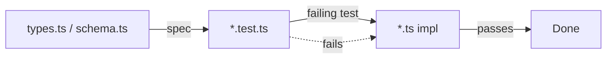
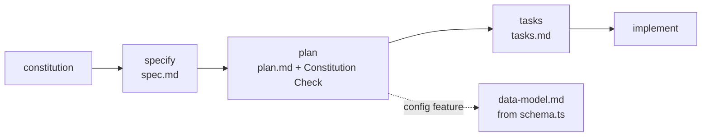
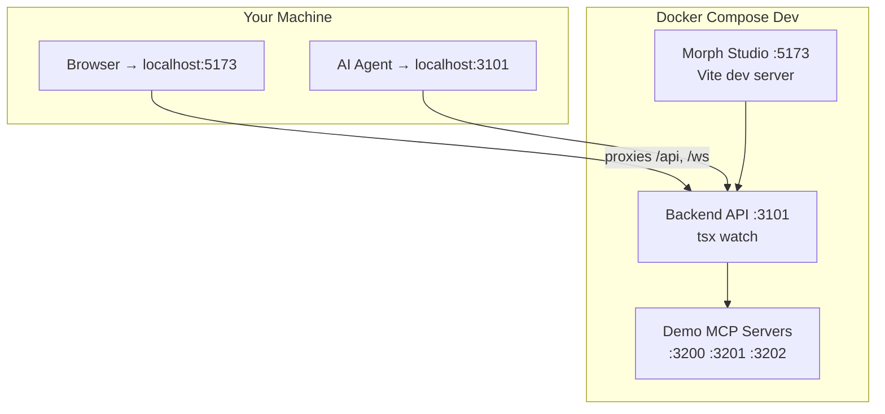
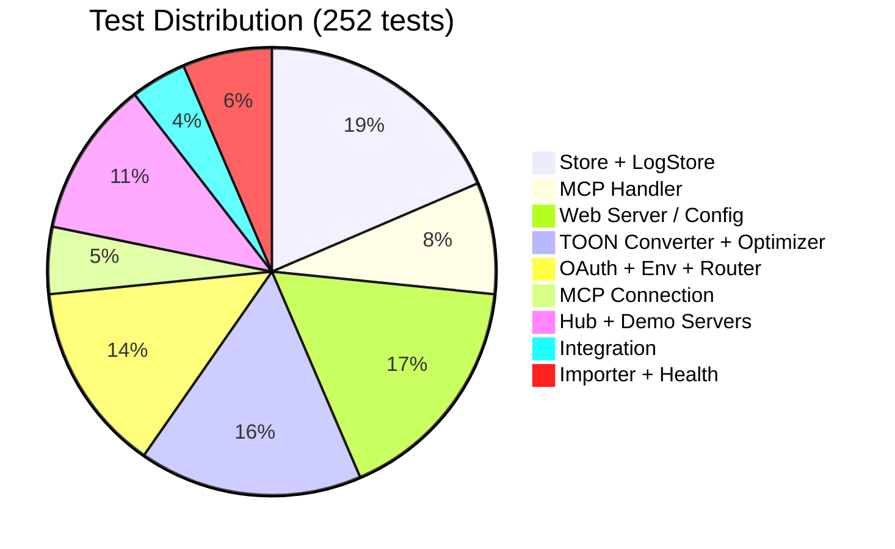
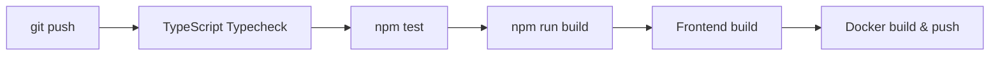

# Development

MORPH follows **Specification-Driven Development (SDD)**: write the contract (types/schema) first, then a failing test, then the implementation.



## Spec Kit workflow

On top of the SDD-Zod loop, MORPH uses **[GitHub Spec Kit](https://github.com/github/spec-kit)** as a governance layer: every feature gets a versioned specification before code. Project principles are codified once in `.specify/memory/constitution.md` and every plan must pass a Constitution Check gate.



Drive it with the installed skills: `/speckit-constitution → /speckit-specify → /speckit-plan → /speckit-tasks → /speckit-implement`. Each feature lives in `specs/NNN-feature/` (`spec.md` = what/why, `plan.md` = how, `tasks.md` = steps, optional `data-model.md`/`contracts/`).

The Spec Kit sits **above** the zod contract — the spec describes the feature; the zod schema in `src/config/schema.ts` remains the executable contract it references (`gen:schema` regenerates the JSON schemas; never hand-edit them). The v2.0 features are documented retroactively under `specs/` (`001`–`010`).

## Everything Runs in Docker

No local Node toolchain is needed.

```bash
# Install + test (252+ tests across 31 test files)
docker run --rm -v "$PWD":/app -w /app node:22 sh -c "npm install && npm test"

# Typecheck
docker run --rm -v "$PWD":/app -w /app node:22 sh -c "npm install && npm run typecheck"

# Build (emits dist/)
docker run --rm -v "$PWD":/app -w /app node:22 sh -c "npm install && npm run build"

# Regenerate schema.json from the zod schema
docker run --rm -v "$PWD":/app -w /app node:22 sh -c "npm install && npm run gen:schema"
```

## Dev Stack (Hot-Reload)



```bash
# Start all services
docker compose -f docker-compose.dev.yml up -d

# Individual services:
docker compose -f docker-compose.dev.yml up -d morph           # Backend API (hot-reload, port 3101)
docker compose -f docker-compose.dev.yml up -d morph-studio    # Frontend (hot-reload, port 5173)
docker compose -f docker-compose.dev.yml up -d mcp-test-servers # Demo MCPs (ports 3200-3202)

# View logs
docker compose -f docker-compose.dev.yml logs -f morph

# Restart a service (picks up file changes)
docker compose -f docker-compose.dev.yml restart morph

# Full reset (removes volumes)
docker compose -f docker-compose.dev.yml down -v
```

> `node_modules` and `dist` are created as root by the container. To reclaim ownership: `docker run --rm -v "$PWD":/app -w /app node:22 chown -R "$(id -u):$(id -g)" /app/node_modules /app/dist`.

## Source Layout

```
src/
├── index.ts              CLI + bootstrap + graceful shutdown
├── hub.ts                Hub coordinator (heart of MORPH)
├── metrics.ts            Live aggregate metrics
├── healthcheck.ts        Docker HEALTHCHECK probe
├── config/               Types, zod schema, loader, watcher
├── utils/                Env resolver, retry, version, typed errors
├── logging/              Pino logger (→ stderr), circular log store (LogStore)
├── mcp-client/           Base client + stdio/http/sse + factory + registry
│   ├── oauth-store.ts    OAuth session persistence
│   └── oauth-provider.ts OAuthClientProvider for MCP SDK
├── router/               Tool → backend routing + conflict resolution
├── toon/                 Converter + optimizer + savings stats
├── health/               Periodic backend ping
├── mcp-server/           Agent-facing MCP server + built-in tools
├── import/               Claude/VS Code config importers
├── persistence/          SQLite store (logs + call stats)
├── examples/             Demo MCP servers (stdio, http, sse, oauth, params)
└── web/                  Fastify REST API + WebSocket + static Studio

web-frontend/             Morph Studio (Vite + React 19, Tailwind v4, shadcn/ui)
tests/
├── unit/                 16 test files, 124+ tests
│   ├── store.test.ts     SQLite persistence + ID sync
│   ├── log-store.test.ts In-memory log store (custom IDs, field preservation)
│   ├── hub.test.ts       Built-in tool TOON conversion
│   ├── demo-servers.test.ts Demo MCP server startup + tool calls
│   └── ...
├── integration/          Real stdio MCP round-trip + TOON
└── fixtures/             Test MCP server (echo/fail/delay/large_json)
```

## Test Coverage



## CI Pipeline



Two GitHub Actions workflows handle CI/CD automatically:

- **ci.yml** — runs on push/PR to `main`: typecheck → test → build
- **docker.yml** — runs on push to `main` + tags `v*`: build & push Docker image to GHCR

## ESM Notes

The project is pure ESM (`"type": "module"`, TS `NodeNext`). Intra-package imports use explicit `.js` extensions even from `.ts` files — that is how NodeNext resolves compiled output. The MCP SDK and `@toon-format/toon` are ESM-only.

## Testing

- Unit tests are pure and fast.
- The integration test spawns the fixture MCP server via the locally-installed `tsx` binary (`node_modules/.bin/tsx`), so no build step is required to run `npm test`.
- Logger output goes to **stderr** so it never corrupts the stdio MCP protocol on stdout — keep it that way.
