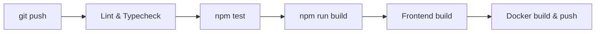

# Testing

MORPH has **252+ tests across 31 test files** with 100% source file coverage.

## Running Tests

### All tests (Docker)

```bash
docker run --rm -v "$PWD":/app -w /app node:22 sh -c "npm install && npm test"
```

### Watch mode

```bash
docker run --rm -v "$PWD":/app -w /app node:22 sh -c "npm install && npm run test:watch"
```

### Specific test file

```bash
docker run --rm -v "$PWD":/app -w /app node:22 sh -c "npm install && npx vitest run tests/unit/store.test.ts"
```

### Without Docker

Requires Node.js >= 22 and `npm install`:

```bash
npm test                    # All tests
npx vitest run --reporter=verbose  # Verbose output
npx vitest run tests/unit/hub.test.ts  # Single file
```

## Test Files

| File                                     | Tests | Scope                                           |
| ---------------------------------------- | ----- | ----------------------------------------------- |
| `tests/unit/store.test.ts`               | 18    | SQLite CRUD, ID sync, totalizers                |
| `tests/unit/log-store.test.ts`           | 5     | In-memory store, custom IDs, field preservation |
| `tests/unit/hub.test.ts`                 | 6     | Built-in tools TOON conversion                  |
| `tests/unit/demo-servers.test.ts`        | 8     | STDIO/HTTP/SSE/OAuth demo server tests          |
| `tests/unit/mcp-connection.test.ts`      | 6     | MCPClientRegistry lifecycle + tool calls        |
| `tests/unit/mcp-handler.test.ts`         | 10    | JSON-RPC handler, error codes                   |
| `tests/unit/web-server.test.ts`          | 14    | Schema validation                               |
| `tests/unit/toon-converter.test.ts`      | 4     | TOON encode/decode                              |
| `tests/unit/optimizer.test.ts`           | 16    | Uniform array, max depth, decideConvert         |
| `tests/unit/router.test.ts`              | 5     | Tool resolution, conflicts                      |
| `tests/unit/oauth-store.test.ts`         | 7     | OAuth CRUD, persistence                         |
| `tests/unit/config-loader.test.ts`       | 7     | Config parsing, validation                      |
| `tests/unit/env-resolver.test.ts`        | 5     | Environment variable resolution                 |
| `tests/unit/importer.test.ts`            | 4     | Config import from Claude/VS Code               |
| `tests/unit/health-checker.test.ts`      | 4     | Start/stop, refresh tools                       |
| `tests/integration/tool-routing.test.ts` | 5     | Real stdio round-trip + TOON conversion         |

## Writing New Tests

### Patterns

Tests use Vitest with the standard `describe` / `it` / `expect` pattern:

```typescript
import { describe, it, expect } from "vitest";

describe("MyModule", () => {
  it("should do something", () => {
    const result = myFunction("input");
    expect(result).toBe("expected");
  });
});
```

### Mocks

For tests that need to avoid real I/O, use Vitest mocks:

```typescript
import { vi, describe, it, expect } from "vitest";

// Mock a module
vi.mock("../src/config/loader", () => ({
  loadConfig: vi.fn().mockResolvedValue(mockConfig),
}));

// Mock a class method
const mockConnect = vi.fn().mockResolvedValue(undefined);
vi.spyOn(Registry.prototype, "connect").mockImplementation(mockConnect);
```

### Fixture MCP Server

The test suite includes a fixture MCP server at `tests/fixtures/` that supports:

- `echo` — echoes arguments
- `fail` — returns an error
- `delay` — responds after a configurable delay
- `large_json` — returns a large payload for TOON conversion testing

Use it in integration tests:

```typescript
import { spawn } from "node:child_process";

const fixture = spawn("npx", ["tsx", "tests/fixtures/test-server.ts"]);
```

## CI Pipeline



### GitHub Actions

Two workflows handle CI/CD:

1. **ci.yml** — on push/PR to `main`: typecheck → test → build
2. **docker.yml** — on push to `main` + tags `v*`: build & push Docker image to GHCR

## Code Coverage Targets

| Area         | Target | Current |
| ------------ | ------ | ------- |
| Source files | 100%   | 100%    |
| Statements   | >90%   | ~95%    |
| Branches     | >85%   | ~90%    |
| Functions    | >90%   | ~95%    |

Run coverage locally:

```bash
docker run --rm -v "$PWD":/app -w /app node:22 sh -c "npm install && npx vitest run --coverage"
```

## Best Practices

1. **Test the contract, not the implementation** — focus on input/output behavior
2. **Use fixtures for complex setup** — reuse the test MCP server and mock configs
3. **Keep unit tests fast** — avoid filesystem and network in unit tests
4. **Log to stderr** — never write to stdout in tests (it corrupts the MCP protocol)
5. **Follow SDD** — write the failing test before the implementation
