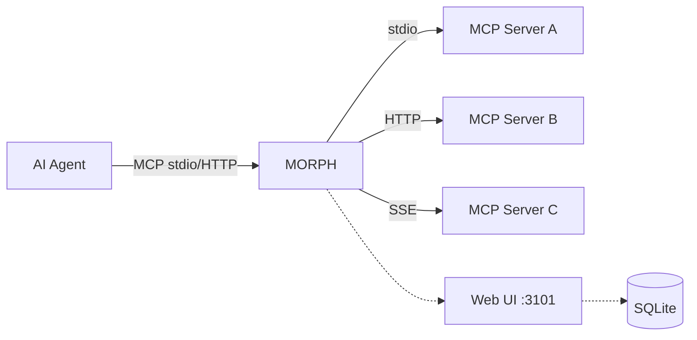
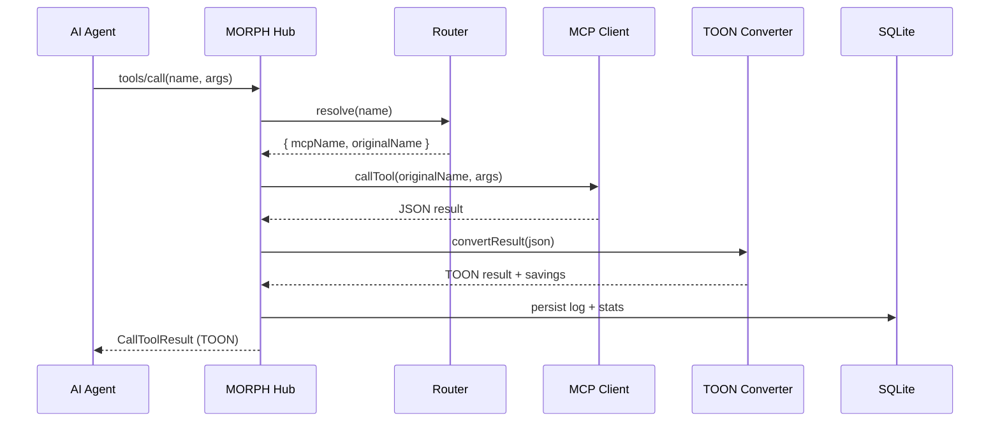

# MORPH

**MCP Optimized Response Protocol Handler** — v2.0

TOON (Token-Oriented Object Notation) is a compact data format that cuts token usage by 30–60% compared to JSON. MORPH is a **gateway proxy** that sits between your AI agents and your MCP servers, automatically converting JSON responses to TOON — no MCP changes required.



## Quick Start

```bash
git clone https://github.com/wagner-sousa/morph.git
cd morph
docker compose -f docker-compose.dev.yml up -d
```

Open **http://localhost:5173** for the Web UI.

## Features

- **Single entry point** — One MCP config for all your servers
- **Automatic TOON conversion** — JSON → TOON on every response, saving 30–60% tokens
- **Multi-transport** — Connect MCPs via stdio, HTTP, or SSE
- **OAuth support** — Built-in OAuth client provider for HTTP MCPs with Dynamic Client Registration
- **Config hot-reload** — Edit `morph.json` without restarting
- **Import existing configs** — Migrate from Claude Desktop or VS Code
- **Web UI (Morph Studio)** — Dashboard, logs, stats, MCP management, TOON savings charts
- **Real-time** — WebSocket for live logs, health, and metrics
- **SQLite persistence** — Call history, token savings, time-series stats
- **Docker-native** — Volume-based config, transport selection via `MORPH_TRANSPORT`
- **252+ tests** — 31 test files, 100% source file coverage

## How It Works


